## Deploy DID Registry

In order to make use of the DIDRegistry as a blockchain-based DID method
for public key registration and control, it is necessary to clone the
repository containing the smart contracts and install some additional
tools. Below are the steps to follow to have the full environment that
allows a correct deployment.


1.  To clone the repository, execute the following
    command:

``` bash 
$ git clone https://github.com/lacchain/lacchain-did-registry
```

The output of the command should download the **contracts** folder from the
repository, as shown in the following image:

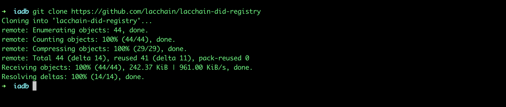

2. Once the repository is cloned, we proceed to deploy
    the smart contracts using the OpenZeppelin Command Line Interface
    (CLI). To do this, the following command must be executed:

``` bash 
$ npm i @openzeppelin/cli
```

The above will install the OpenZeppelin CLI in the folder where the
command is run:

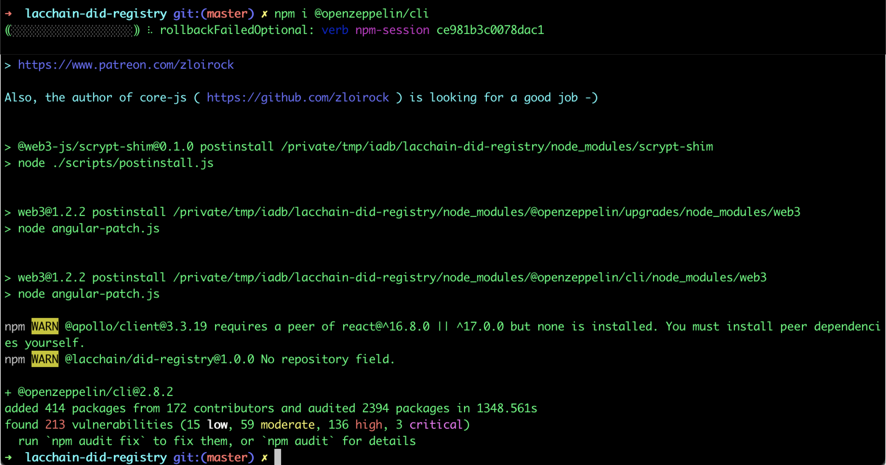

**Note:** Optionally is possible
to install the tool globally by adding the -g flag to the previous
command, which will allow you to execute the OpenZeppelin CLI from any
other project.

3. Once the OpenZeppelin CLI is installed, it is
    necessary to edit the network configuration to be used for the
    deployment. Inside the repository we rename the example
    configuration file called **truffle-config.default** to
    **truffle-config.js**

``` bash 
$ mv truffle-config.default truffle-config.js
```

And we edit the truffle-config.js file to include the LACChain network
configuration. Consider the following code:

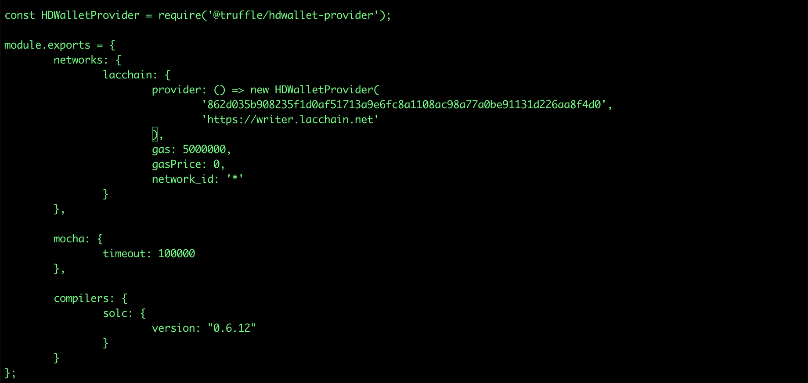

4. Once the **truffle-config.js** file has
    been saved, we proceed to initialize the OpenZeppelin project using
    the following command:

``` bash 
$ npx oz init
```

The command will request a name to the project: which is usually the
same name as the repository and the version: which is normally 1.0.0.

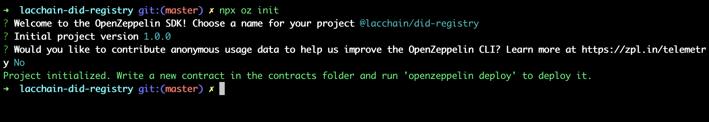

5. After initializing the OpenZeppelin project it is
    possible to deploy the DIDRegistry contract with the following
    command:

``` bash 
$ npx oz deploy
```

The above command will invoke the OpenZeppelin CLI that has been
installed above the directory. If the tool was installed globally, the
npx prefix can be omitted. When deploying the contract OpenZeppelin will
ask us to select the type of deployment: regular, the network: lacchain,
and the contract to deploy: DIDRegistry, as shown below:

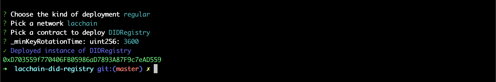

After executing the OpenZeppelin CLI command, it will
return the address of the new DIDRegistry contract deployed, in this
case: **0xD703559f770406FB05986aD7893A87F9c7eAD559**


## Deploy DID Registry Recoverable

If you want to use the key recovery functions for a DID, you need to
deploy the smart contract called DIDRegistryRecoverable. This contract
is in the same repository that has been cloned. To deploy it, we execute
the same command as the previous step:

``` bash 
$ npx oz deploy
```

To execute the command, the following parameters are used:

- **network**: lacchain
- **contract**: DIDRegistryRecoverable
- **minKeyRotationTime (uint)**: The minimum time (in seconds) to
automatically rotate the controller (inherited from the
DIDRegistry).
- **maxAttempts (uint)**: the maximum number of failed attempts in the
reboot period.
- **minControllers (uint)**: the minimum number of controllers the
account must have in order to use this feature.
- **resetSeconds (uint)**: the restart time period (in seconds).
When the count exceeds the maxAttempts, the count must wait to reach the
resetSeconds time before calling the function again to retrieve the
count. When this period of time is reached, the keys tested successfully
to recover the account will be deleted, in that case it is necessary to
retest the drivers to recover the account.

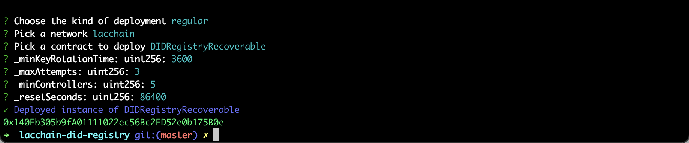

After executing the OpenZeppelin CLI command, it will
return the address of the new DIDRegistryRecoverable contract deployed,
in this case: **0x140Eb305b9fA01111022ec56Bc2ED52e0b175B0e**

## Create a new DID

To interact with smart contracts in a simpler way it is possible to use
a Javascript library (Node JS), which can be found in the following
repository: https://github.com/lacchain/lacchain-did-js.

The library is developed in version 14.4 of Node JS, to install this
version it is recommended to use the NVM version manager
(https://github.com/nvm-sh/nvm), executing the following command:

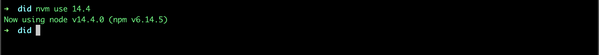

After installing the corresponding version, a DID can be created using
the following code snippet:

``` javascript
import { DID } from '@lacchain/did'
const did = new DID( {
   registry: '0xbDa1238272FDA6888556449Cb77A87Fc8205E8ba',
   rpcUrl: 'https://writer.lacchain.net',
   network: 'main'
} );
console.log( did.id );
```

The result of the execution will give us the identifier associated with
the DID, as shown in the following image:

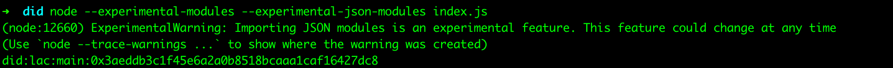

The identifier of the new generated DID is: **did:lac:main:0x3aeddb3c1f45e6a2a0b8518bcaaa1caf16427dc8**

## Add a new Verification Method

Continuing with Node JS version 14.4, a new Verification Method for the
DID can be added using the following code snippet:

``` javascript
import { DID } from ‘@lacchain/did'

const did = new DID( {
   registry: '0xbDa1238272FDA6888556449Cb77A87Fc8205E8ba',
   rpcUrl: 'https://writer.lacchain.net',
   network: 'main'
} );

did.addVerificationMethod( {
   type: 'vm',
   algorithm: 'esecp256k1rm',
   encoding: 'hex',
   publicKey: "0x0000000000000000000000",
   controller: did.id,
   expiration: 31536000 // default: 31536000
} ).then( async() => {
   const document = await did.getDocument();
   console.log( document );
} );

```

The result of the execution will give us the document associated with
the DID, which includes the new Verification Method as shown in the
following image:

``` json
{
  id: 'did:lac:main:0xbc9b80970f7fe7c1651d684d1a9d476a6c9ee4b1',
  controller: 'did:lac:main:0xbc9b80970f7fe7c1651d684d1a9d476a6c9ee4b1',
  verificationMethod: [
    {
      id: 'did:lac:main:0xbc9b80970f7fe7c1651d684d1a9d476a6c9ee4b1#vm-0',
      type: 'EcdsaSecp256k1VerificationKey2019',
      controller: 'did:lac:main:0xbc9b80970f7fe7c1651d684d1a9d476a6c9ee4b1',
      blockchainAccountId: '0xbc9b80970f7fe7c1651d684d1a9d476a6c9ee4b1'
    },
    {
      id: 'did:lac:main:0xbc9b80970f7fe7c1651d684d1a9d476a6c9ee4b1#vm-1',
      type: 'EcdsaSecp256k1RecoveryMethod2020',
      controller: 'did:lac:main:0xbc9b80970f7fe7c1651d684d1a9d476a6c9ee4b1',
      publicKeyHex: '0000000000000000000000'
    }
  ],
  ...
}
```

## Add a new Controller

Each DID can have more than one associated controller, with which the
Automatic Key Rotation functions can be used and help to regain control
of a DID (Key Recovery). To add a new controller to the DID, we can use
the following code snippet:

``` javascript
import { DID } from '@lacchain/did'

const did = new DID( {
	registry: '0xbDa1238272FDA6888556449Cb77A87Fc8205E8ba',
	rpcUrl: 'https://writer.lacchain.net',
	network: 'main'
} );

did.addController( '0x2Da061c6cFA5C23828e9D8dfbe295a22e8779712' ).then( async () => {
	const controllers = await did.getControllers();
	console.log( controllers );
} );
```

The result of the execution will show us the list of DID controllers,
which includes the address of the new controller
(0x2Da061c6cFA5C23828e9D8dfbe295a22e8779712) as shown in the following
image:

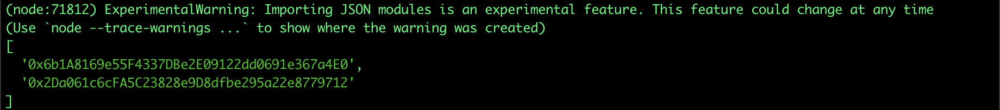

## Change the active Controller

Each DID have only one active controller, which has the ability to modify
the DID Document. After adding a new controller it is possible to change
the active controller using the following code snippet:

``` javascript
import { DID } from '@lacchain/did'

const did = new DID( {
	registry: '0xbDa1238272FDA6888556449Cb77A87Fc8205E8ba',
	rpcUrl: 'https://writer.lacchain.net',
	network: 'main'
} );

did.addController( '0x2Da061c6cFA5C23828e9D8dfbe295a22e8779712' ).then( async () => {
	const controllers = await did.getControllers();
	console.log( controllers );
} );
```

The result of the execution will show us the current active controller
of the DID, which corresponds to the address of the new controller added
(**0x2Da061c6cFA5C23828e9D8dfbe295a22e8779712**), as shown in the following
image:

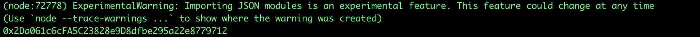

## Enable Automatic Key Rotation

One of the main features of the lac method from DID is
the ability to automatically rotate the active controller for each DID.
Each DID can specify a different automatic-rotation time for its active
controller as long as it has more than one controller registered.
Automatic Key Rotation can be enabled by specifying the rotation time
(in seconds) considering as a condition that it is greater than or equal
to the **minKeyRotationTime** parameter that was defined at the time of deployment of the
DIDRegistry or DIDRegistryRecoverable contract. Below is the code
snippet that enables you to enable Automatic Key Rotation for a
DID:

``` javascript
import { DID } from '@lacchain/did'

const sleep = seconds => new Promise( resolve => setTimeout( resolve, seconds * 1e3 ) );

const did = new DID( {
	registry: '0xbDa1238272FDA6888556449Cb77A87Fc8205E8ba',
	rpcUrl: 'https://writer.lacchain.net',
	network: 'main'
} );

did.addController( '0x2Da061c6cFA5C23828e9D8dfbe295a22e8779712' ).then( async () => {
	console.log( await did.getController() );
	await did.enableKeyRotation( 10 );
	await sleep( 11 );
	console.log( await did.getController() );
} );
```

The result of the execution will show us the current active controller
of the DID and after 10 seconds the new controller added:
**0x2Da061c6cFA5C23828e9D8dfbe295a22e8779712**, as shown in the following
image:

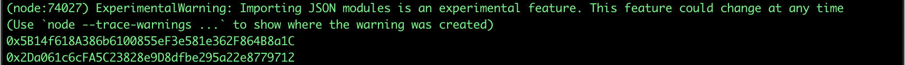

## Controller Key Recovery

It is possible to make use of the key recovery function of the
**DIDRegistryRecoverable** contract using the same javascript library,
fulfilling the following conditions:

1. Add to the DID the minimum number of controllers
    specified in the Smart Contract at the time of its deployment
    (**minControllers**). In this specific case: 5
2. Not having the automatic key rotation feature enabled
3. Possess the private keys of at least N / 2 + 1
   controllers, where N is the number of controllers in the DID. In
   this case 5/2 + 1 controllers = 3 should be tested

The following code snippet shows how it is possible to regain access to
the DID by setting as the active controller the last controller for
which we tried to have the private key:

``` javascript
import { DIDRecoverable } from '@lacchain/did'

const did = new DIDRecoverable( {
	registry: '0x140Eb305b9fA01111022ec56Bc2ED52e0b175B0e',
	rpcUrl: 'https://writer.lacchain.net',
	network: 'main'
} );

const controllers = [
	{ address: '0x9a0d6fcbe696b30aadb8b10f71a8d14502b38325', privateKey: 'e4cae20a84c2b06f733928ac8fe7c8fea2bf56340e945441a5c500a70a9f9444' },
	{ address: '0x5ac03d827dc1caad73933d375f0f85a77efd8514', privateKey: '6c782722b2311eed153ca657efe5132271f0ccd4e7a88015927db30eeddd39c8' },
	{ address: '0x6a3bf40f418ad5af57e58c1db6e65b7458f6e421', privateKey: '27ebca688eb924168ba68cd71247a5ecb73aa738f0b595ecdf875e7531e1187d' },
	{ address: '0xfce1066dfd086c03fd0b83d81160ad808983bc88', privateKey: 'adbff22951acb7680cbba6c3ff7639f88498e8c4991d2dcd266026b2c27553c1' },
]

async function recover() {
	await did.addController( controllers[0].address );
	await did.addController( controllers[1].address );
	await did.addController( controllers[2].address );
	await did.addController( controllers[3].address );

	const currentController = await did.getController();
	console.log( { currentController } );
	await did.recover( controllers[3].address, controllers[3].privateKey );
	await did.recover( controllers[2].address, controllers[2].privateKey );
	await did.recover( controllers[1].address, controllers[1].privateKey );
	const recoveredController = await did.getController();
	console.log( { recoveredController } );
}

recover();
```

The code first adds 4 additional controllers that added to the initial
controller add up to 5, then it invokes the recover function to test
that it has the private key of 3 additional controllers. Finally, when
the **DIDRegistryRecoverable** detects that the conditions have been met, it
sets the active controller to the last controller that was tested (in
this case the controllers[1] corresponding to the address:
**0x5ac03d827dc1caad73933d375f0f85a77efd8514**), as shown in the following
image:

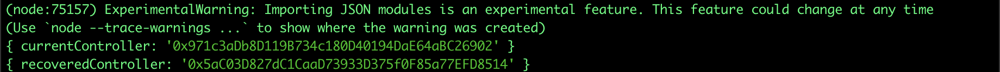

## Revoke a Verification Method

The process of revocation of a Verification Method is
very simple and consists of calling the **revokeVerificationMethod** function
of the **DIDRegistry** or **DIDRegistryRecoverable**, as shown in the following
code fragment:

``` javascript
import { DID } from '@lacchain/did'

const did = new DID( {
	registry: '0xbDa1238272FDA6888556449Cb77A87Fc8205E8ba',
	rpcUrl: 'https://writer.lacchain.net',
	network: 'main'
} );

const vm = {
	type: 'vm',
	algorithm: 'esecp256k1rm',
	encoding: 'hex',
	publicKey: "0x0000000000000000000000",
	controller: did.id,
	expiration: 31536000
};

did.addVerificationMethod( vm ).then( async() => {
	console.log( 'With VM', ( await did.getDocument() ).verificationMethod );
	await did.revokeVerificationMethod( vm );
	console.log( 'Without VM', ( await did.getDocument() ).verificationMethod );
} );
```

In the following image we can see how the Verification Method disappears
from the DID Document when we revoke them.

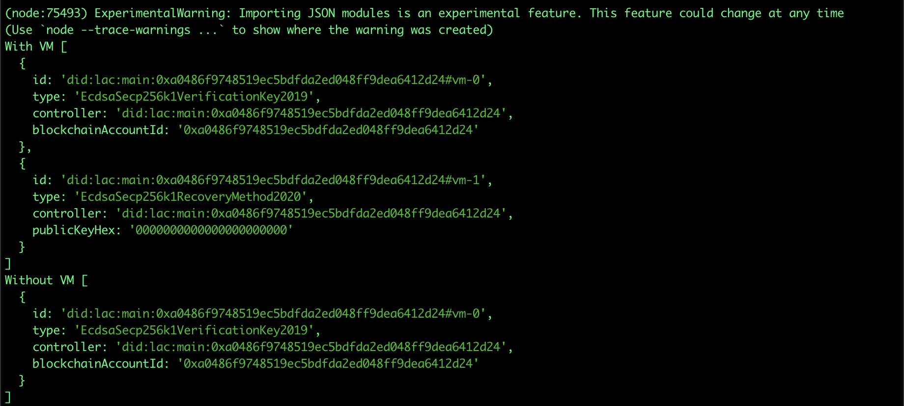

## Resolve the DID Document

The way to resolve the DID Document is based on exploring the events
issued by the Smart Contract (see ERC 1066). However, the javascript
library simplifies the resolution process by simply invoking the
getDocument method of the DIDRegistry, as shown below:

``` javascript
import { DID } from '@lacchain/did'

const did = new DID( {
	registry: '0xbDa1238272FDA6888556449Cb77A87Fc8205E8ba',
	rpcUrl: 'https://writer.lacchain.net',
	network: 'main'
} );

async function getDocument(){
	const document = await did.getDocument();
	console.log( document.document );
}

getDocument();
```

The result you get is the original structure of a DID Document, pointing
by referencing the verification methods, as shown in the following
image:

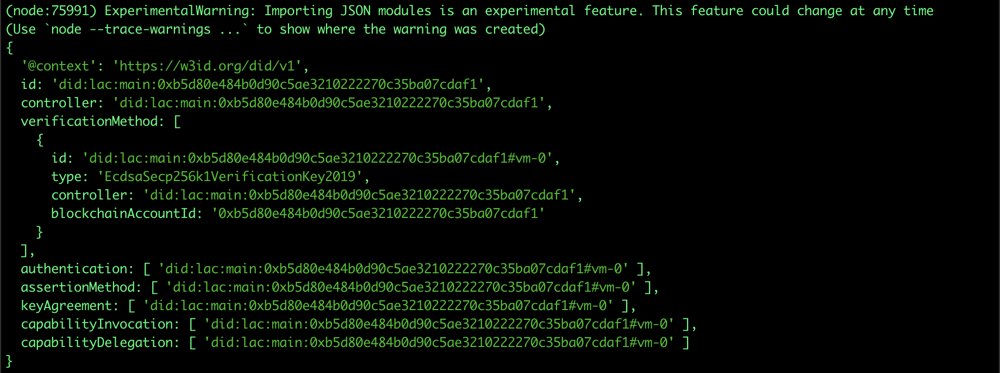