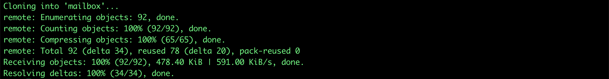
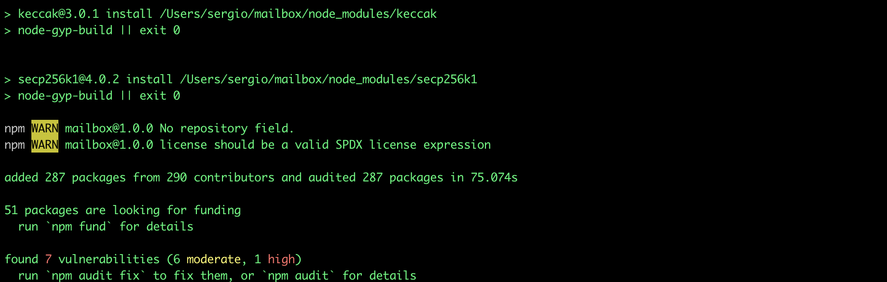
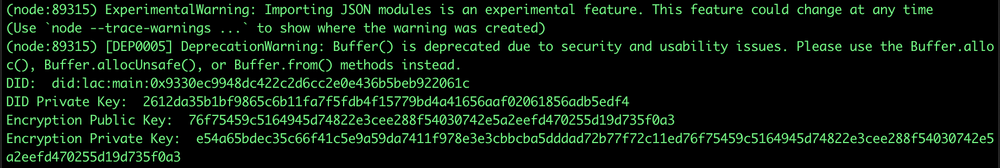
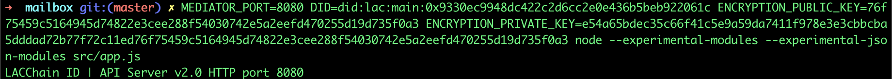
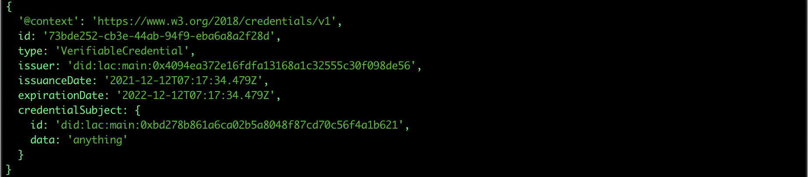

## Deploy Mailbox Service

In order to use the mailbox as a message exchange point, it is not
necessary to deploy a new service, since there is the official mailbox
managed by LACChain at the following address:
https://mailbox.lacchain.net.

However, if you want to use it as a self-managed service and be able to
control the keys and authentication services, it is possible to do so
from the official repository (https://github.com/lacchain/mailbox).

The code is developed in NodeJS version 14.4 and uses the Redis version
4.0 database engine, so it is necessary to install these programs.

Below are the steps to be able to deploy the Mailbox locally directly
from the source code.

1. To clone the repository, execute the following
    command:

``` bash
$ git clone https://github.com/lacchain/mailbox
```

The output of the command should download the source code folder of the
Mailbox, as shown in the following image:



2. Once the repository is cloned, we proceed to
    install version 14.4 of NodeJS. To install this version it is
    recommended to use the NVM version manager
    (https://github.com/nvm-sh/nvm), executing the following
    command:


3. After changing to version 14.4 of NodeJS, we are
    going to install the project's dependencies by entering the folder
    downloaded by git (cd mailbox) and using the following
    command:

``` bash
$ npm install 
```

The command will download and install the necessary dependencies for the
execution of the Mailbox.



4. Before being able to execute the Mailbox it is
    necessary to configure some environment variables for the correct
    working of the system:

- DID_RESOLVER_URL: The address of the Universal DID Resolver service (default: https://resolver.lacchain.net/)
- DID: The DID associated with the Mailbox (it is necessary to generate a new one)
- ENCRYPTION_PUBLIC_KEY: The public encryption key associated with the Mailbox DID (it is necessary to generate and associate the public key with the DID)
- ENCRYPTION_PRIVATE_KEY: The private encryption key associated with the Mailbox DID (it is necessary to generate and associate the private key with the DID)
- REDIS_HOST: The Redis server address (default: localhost)
- REDIS_PORT: The Redis server port (default: 6379)
- MEDIATOR_PORT: The API port exposed by the Mailbox

As we can see, the Mailbox needs a DID and a pair of encryption keys,
for this there is a utility within the repository that helps to generate
it automatically by means of the following command:

``` bash
$ node --experimental-modules --experimental-json-modules src/did.js 
```

The above command generates an encryption key pair (using the sodium
library algorithm) and adds it as a Verification Method (keyAgreement)
to a new DID, resulting in the following:



From the execution of the previous command, the following environment
variables can be assigned:

- DID: did:lac:main:0x9330ec9948dc422c2d6cc2e0e436b5beb922061c
- ENCRYPTION_PUBLIC_KEY: 76f75459c5164945d74822e3cee288f54030742e5a2eefd470255d19d735f0a3
- ENCRYPTION_PRIVATE_KEY: e54a65bdec35c66f41c5e9a59da7411f978e3e3cbbcba5dddad72b77f72c11ed76f75459c5164945d74822e3cee288f54030742e5a2eefd470255d19d735f0a3

Finally, we proceed to start the Mailbox service using the following
command:

``` bash
$ MEDIATOR_PORT=8080 \
  DID=did:lac:main:0x9330ec9948dc422c2d6cc2e0e436b5beb922061c \
  ENCRYPTION_PUBLIC_KEY=76f75459c5164945d74822e3cee288f54030742e5a2eefd470255d19d735f0a3 \
  ENCRYPTION_PRIVATE_KEY=e54a65bdec35c66f41c5e9a59da7411f978e3e3cbbcba5dddad72b77f72c11ed76f75459c5164945d74822e3cee288f54030742e5a2eefd470255d19d735f0a3 \
  node --experimental-modules --experimental-json-modules src/app.js
```

If everything has gone well, you should see the following result in the
terminal, indicating that the Mailbox service is running on port 8080:



## Deploy the Mailbox using Docker

Alternatively, it is possible to deploy the Mailbox
using the official Docker image in the following uri: ghcr.io/lacchain/mailbox:latest

To deploy the service using Docker with the same environment variables,
the following commands can be used:

``` bash
$ docker pull ghcr.io/lacchain/mailbox:latest

$ docker run -p 8080:8080 \
-e MEDIATOR_PORT=8080 \
-e DID=did:lac:main:0x9330ec9948dc422c2d6cc2e0e436b5beb922061c \
-e ENCRYPTION_PUBLIC_KEY=76f75459c5164945d74822e3cee288f54030742e5a2eefd470255d19d735f0a3 \
-e ENCRYPTION_PRIVATE_KEY=e54a65bdec35c66f41c5e9a59da7411f978e3e3cbbcba5dddad72b77f72c11ed76f75459c5164945d74822e3cee288f54030742e5a2eefd470255d19d735f0a3 \
ghcr.io/lacchain/mailbox:latest
```

## Authentication

In order to interact with the API exposed by the Mailbox, it is
necessary to carry out an authentication process based on the DID
Connect standard (https://github.com/KayTrust/did-connect). The
following code snippet shows an example of how to generate an access
token:

``` javascript
import didJWT from "did-jwt";
import moment from "moment";

const MAILBOX_DID = 'did:lac:main:0x9330ec9948dc422c2d6cc2e0e436b5beb922061c';

const user = {
	did: 'did:lac:main:0xf3beac30c498d9e26865f34fcaa57dbb935b0d74',
	privateKey: '278a5de700e29faae8e40e366ec5012b5ec63d36ec77e8a2417154cc1d25383f'
};

didJWT.createJWT(
	{ sub: user.did, aud: MAILBOX_DID, exp: moment().add( 1, 'minutes' ).valueOf() },
	{ issuer: user.did, signer: didJWT.ES256KSigner( user.privateKey ) },
	{ alg: 'ES256K' }
).then( console.log );
```

To execute the above code, you have to execute the following command
inside the root folder of the repository (assuming that the file is
called auth.js):

``` bash
$ node --experimental-modules auth.js 
```

The result of the execution will give us the generated JWT to
authenticate to the Mailbox, as shown in the following image:


## Send a Verifiable Credential

Once the access token to the Mailbox has been generated, it must be
included as an HTTP header (Authorization) in each Request to the
service. The Mailbox service allows you to send any type of message,
however, the following code snippet shows how to send a Verifiable
Credential (VC):

``` javascript
import didJWT from "did-jwt";
import moment from "moment";
import { didCommService } from "./src/services/index.js";
import axios from "axios";

const MAILBOX_DID = 'did:lac:main:0x9330ec9948dc422c2d6cc2e0e436b5beb922061c';
const alice = {
	did: 'did:lac:main:0x4094ea372e16fdfa13168a1c32555c30f098de56',
	privateKey: '4a1ee35bc72b5ce4f49b57d0318a622963a5191b7ad460572c343f31ebaf2e9c',
	keyPair: {
		publicKey: 'd442f5164b0a8eca6eab64afcaca86af3b3df62591dc1dbaa3f90843c9bdc2b2',
		privateKey: 'a2176c619dc06fa60bb499873fc49b3938f552e4191d9de3f0025d6fee3dfdead442f5164b0a8eca6eab64afcaca86af3b3df62591dc1dbaa3f90843c9bdc2b2'
	}
}
const bob_did = 'did:lac:main:0xbd278b861a6ca02b5a8048f87cd70c56f4a1b621';

async function send() {
	const token = await didJWT.createJWT(
		{ sub: alice.did, aud: MAILBOX_DID, exp: moment().add( 1, 'minutes' ).valueOf() },
		{ issuer: alice.did, signer: didJWT.ES256KSigner( alice.privateKey ) },
		{ alg: 'ES256K' }
	);
	const encryptedToBob = await didCommService.encrypt( {
		'@context': 'https://www.w3.org/2018/credentials/v1',
		id: '73bde252-cb3e-44ab-94f9-eba6a8a2f28d',
		type: 'VerifiableCredential',
		issuer: alice.did,
		issuanceDate: '2021-12-12T07:17:34.479Z',
		expirationDate: '2022-12-12T07:17:34.479Z',
		credentialSubject: {
			id: bob_did,
			data: 'anything'
		}
	}, alice.keyPair, bob_did, true );
	const envelope = {
		"type": "https://didcomm.org/routing/2.0/forward",
		"to": [MAILBOX_DID],
		"expires_time": 1516385931,
		"body": {
			"next": bob_did,
			"payloads~attach": [ encryptedToBob	 ]
		}
	}
	const encryptedToMailbox = await didCommService.encrypt( envelope, alice.keyPair, MAILBOX_DID, true );
	const result = await axios.post( 'http://localhost:8080/vc', encryptedToMailbox, { headers: { token } } );

	console.log( result.status );
}

send();
```

To execute the above code you have to execute the following command
inside the root folder of the repository (assuming that the file is
called send.js):

``` bash
$ node --experimental-modules send.js
```

The result of the execution will give us the HTTP code**200** in case it was
sent correctly or **500** in case of an error.


## Receive a Verifiable Credential

To obtain the credentials sent to a specific DID, it is necessary to
have the private key of the DID and the associated encryption key that
was used to encrypt the message. The process is similar to sending
credentials, first the authentication token is generated and then the
/vc path of the API is queried using the HTTP GET method, as shown in
the following code snippet:

``` javascript
import didJWT from "did-jwt";
import moment from "moment";
import { didCommService } from "./src/services/index.js";
import axios from "axios";

const MAILBOX_DID = 'did:lac:main:0x9330ec9948dc422c2d6cc2e0e436b5beb922061c';

const bob = {
	did: 'did:lac:main:0xbd278b861a6ca02b5a8048f87cd70c56f4a1b621',
	privateKey: '50dfe6a632dbc66e03eec8a3e9971a236847cd506783b17e1927273281999db1',
	keyPair: {
		publicKey: '4c9ddabbb67119640a6f3423422b1fbc6fd676cda71640ae1f9e474973dc6be8',
		privateKey: '4f34a9f691848ce5f1e6cf7dd828b8646714a3c71605679ca48e7a5433dc1e4f4c9ddabbb67119640a6f3423422b1fbc6fd676cda71640ae1f9e474973dc6be8'
	}
}

async function receive() {
	const token = await didJWT.createJWT(
		{ sub: bob.did, aud: MAILBOX_DID, exp: moment().add( 1, 'days' ).valueOf() },
		{ issuer: bob.did, signer: didJWT.ES256KSigner( bob.privateKey ) },
		{ alg: 'ES256K' }
	);

	const result = await axios.get( 'http://localhost:8080/vc', { headers: { token } } );
	const decrypted = await didCommService.decrypt( result.data[0], bob.keyPair );

	const vc = JSON.parse( decrypted.message );
	console.log( vc );
}

receive();
```

To execute the above code you have to execute the following command
inside the root folder of the repository (assuming that the file is
called receive.js):

``` bash
$ node --experimental-modules receive.js
```

The result of the execution will show us the Verifiable Credential sent
by Alice, as shown in the following image:



## Clear the Mailbox

The Mailbox message exchange service was designed and works in a similar
way to the POP3 mail service, with the only difference that the messages
are stored indefinitely. That is why to be able to clean the mailbox of
a DID, the /vc API must be invoked using the HTTP DELETE method to
delete all the messages, as shown in the following code fragment:

``` javascript
import didJWT from "did-jwt";
import moment from "moment";
import axios from "axios";

const MAILBOX_DID = 'did:lac:main:0x9330ec9948dc422c2d6cc2e0e436b5beb922061c';

const bob = {
	did: 'did:lac:main:0xbd278b861a6ca02b5a8048f87cd70c56f4a1b621',
	privateKey: '50dfe6a632dbc66e03eec8a3e9971a236847cd506783b17e1927273281999db1'
}

async function remove() {
	const token = await didJWT.createJWT(
		{ sub: bob.did, aud: MAILBOX_DID, exp: moment().add( 1, 'days' ).valueOf() },
		{ issuer: bob.did, signer: didJWT.ES256KSigner( bob.privateKey ) },
		{ alg: 'ES256K' }
	);

	const result = await axios.delete( 'http://localhost:8080/vc', { headers: { token } } );

	console.log( result.status );
}

remove();
```


The result of the execution will give us the HTTP code **200** in case all the
messages have been correctly eliminated, or **500** in case of an error.

