## Deploy Public Key Directory

In order to use the Public Key Directory (PKD) and Trusted List (TL), it
is necessary to clone the repository that contains the smart contracts
and install some additional tools. Below are the steps to follow to have
an environment to make the correct deployment.


1. To clone the repository, execute the following
    command:

``` bash
$ git clone https://github.com/lacchain/lacchain-pkd
```

The output of the command should download the contracts folder from the
repository, as shown in the following image:

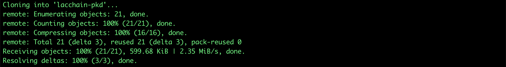

2. Once the repository is cloned, we proceed to deploy
    the smart contracts using the OpenZeppelin Command Line Interface
    (CLI). To do this, the following command must be executed:

``` bash
$ npm i @openzeppelin/cli 
```

The above will install the openzeppelin CLI in the folder where the
command is run:


**Note:** If desired, it is
possible to install the tool globally by adding the -g flag to the
previous command, which will allow executing the openzeppelin command
line from any other project.


3. Once the OpenZeppelin CLI is installed, it is
    necessary to edit the network configuration to be used for the
    deployment. Inside the repository we rename the example
    configuration file called **truffle-config.default** to
    **truffle-config.js**

``` bash
$ mv truffle-config.default truffle-config.js 
```

And we edit the **truffle-config.js** file to include the LACChain network
configuration. Consider the following code:


4. Once the **truffle-config.js** file has been saved, we
    proceed to initialize the OpenZeppelin project using the following
    command:

``` bash
$ npx oz init 
```

The command will request a name to the project: which is usually the
same name as the repository and the version: which is normally 1.0.0.

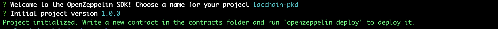

5. After initializing the OpenZeppelin project it is
    possible to deploy the PKD contract with the following
    command:

``` bash
$ npx oz deploy 
```

The above command will invoke the OpenZeppelin CLI that has been
installed above the directory. If the tool was installed globally, the
npx prefix can be omitted. When deploying the contract, OpenZeppelin
will ask us to select the type of deployment: regular, the network:
lacchain, and the contract to deploy: PKD, as shown below:

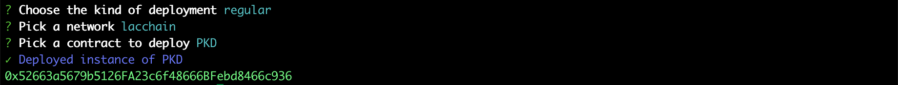

## Deploy a Trusted List

Unlike a PKD, a TL can be linked hierarchically by assigning a parent
contract which can correspond to another TL or a PKD (usually the root
node), therefore the deployment requires specifying that parameter in
the constructor from TL:

``` bash
$ npx oz deploy 
```

In this case, the following parameters must be specified:

- **network**: lacchain
- **contract**: TrustedList
- **parent**: the address of the parent node of the TL (in this case the address of the PKD)
- **role**: 0x114e74f6ea3bd819998f78687bfcb11b140da08e9b7d222fa9c1f1ba1f2aa122
- **tlType**: the type of Trusted List (see EIDAS framework)

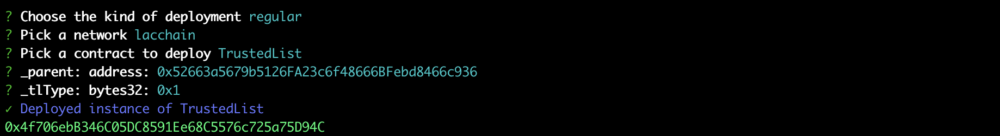

## Register Public Key in PKD

Within the PKD contract, the public keys can be registered associating
them to a DID and point to the DID address by invoking the register
function using the OpenZeppelin CLI tool:

``` bash
$ npx oz send-tx 
```

To execute the command, the following parameters are used:

- **network**: lacchain
- **contract**: PKD
- **function**: register
- **address**: the address of the entity to be registered (it can be the ZERO address of Ethereum)
- **did**: the DID associated with the entity (it can be any DID method) where the public keys are
- **expires**: the expiration time of the public key in seconds

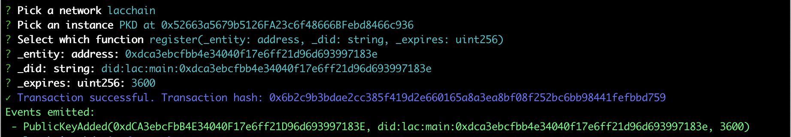

## Register an Entity in TL

Within the PKD contract, the public keys can be registered associating
them to a DID and point to the DID address by invoking the register
function using the OpenZeppelin CLI tool.:

``` bash
$ npx oz send-tx
```

To execute the command, the following parameters are used:

- **network**: lacchain
- **contract**: TrustedList
- **function**: register
- **address**: the address of the entity to be registered (It can be the address of a another TL)
- **did**: the DID associated with the entity (it can be any DID method) where the public keys are
- **expires**: the entity expiration time of the public key in seconds

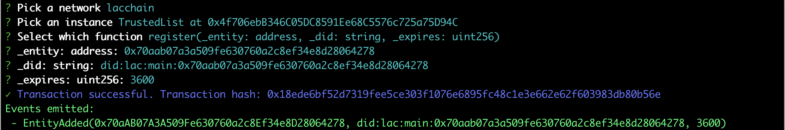

## Verify an Entity in a TL

To check if an entity is registered within a Trusted List is very
simple, you just have to make a call to the entities (address) method of
the Smart Contract, as shown below:

``` bash
$ npx oz call 
```

The call to the contract is made with the following parameters:

- **network**: lacchain
- **contract**: TrustedList
- **function**: entities(address)
- **address**: the address of the entity to be verified

If the entity exists and is registered within the TrustedList, the
result is as follows:

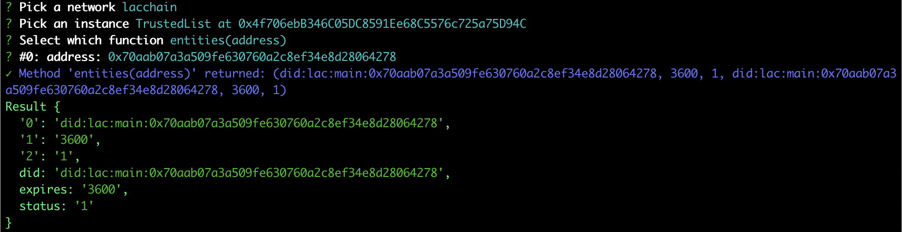

## Verify the Root-of-Trust of an Entity

The Root-of-Trust (RoT) consists of verifying the entity on a TL, but
following hierarchically the path until reaching a root node (usually a
PKD) which is trusted and guarantees the identity of the entire chain.
To verify the RoT it is necessary to execute the previous procedure
recursively obtaining the parent node through the following call to the
TL contract:

``` bash
$ npx oz call 
```

The call to the contract is made with the following parameters:

- **network**: lacchain
- **contract**: TrustedList
- **function**: parent()

Execution of the command will return the address of the parent TL or PKD
which is used to repeat the same verification process. However, in this
case, the address corresponds to a PKD.

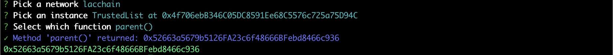

Once the address of the PKD is obtained, we can verify if the TL is
registered as an entity within the PKD. Remember that the TL address is:
**0x4f706ebB346C05DC8591Ee68C5576c725a75D94C**. So we will proceed to find
that address by calling the isActive function of the PKD contract, as
shown below.

The call to the contract is made with the following parameters:

- **network**: lacchain
- **contract**: TrustedList
- **function**: isActive
- **entity**: the entity's address (in this case, the TL's address)

If the entity is registered and has not been revoked, the result will be
a boolean value (true).

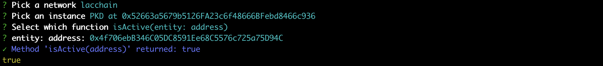

In this way, although an entity can register as the parent node the
address of a valid PKD, the RoT verification process consists of asking
the PKD if the entity or TL is really registered and is valid.

## Revoke an entity in a TL

The revocation process of an entity registered in a TL must be done by
invoking the revoke function of the Smart Contract associated with the
TL from the owner account that deployed the contract..

The invocation of the contract is done with the following parameters:

- **network**: lacchain
- **contract**: TrustedList
- **function**: revoke
- **entity**: the address of the entity (in this case: **0x70aab07a3a509fe630760a2c8ef34e8d28064278**)

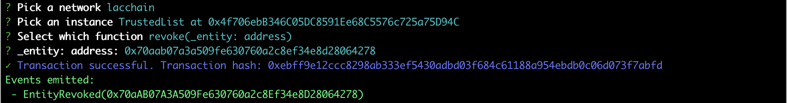

Once the entity is revoked, we can recheck its status by calling the
entices function of the TL, as can be seen in the following image:

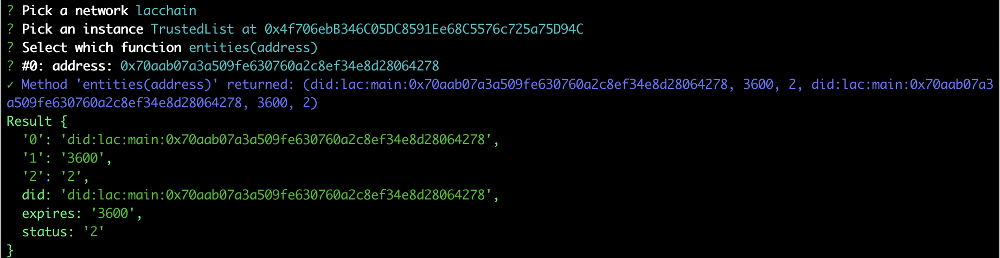

The result shows a status = 2, which indicates that the entity has been
revoked. The status list that is managed within a TL is:

- 0: Unregistered
- 1: Registered
- 2: Revoked

## Revoke an entity in a TL

The process of revoking a public key (which can also be associated with
a TL) is similar to revoking an entity within a TL.

The invocation of the contract is done with the following parameters:

- **network**: lacchain
- **contract**: PKD
- **function**: revoke
- **entity**: the address of the public key (in this case, that of the TL address **0x4f706ebB346C05DC8591Ee68C5576c725a75D94C**)

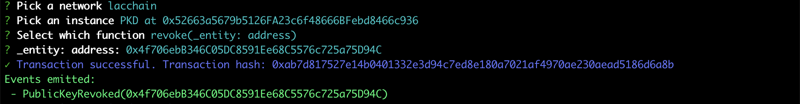

Once the public key associated with a TL has been revoked, we can
recheck its status by calling the **isActive** function of the PKD, as shown
below.

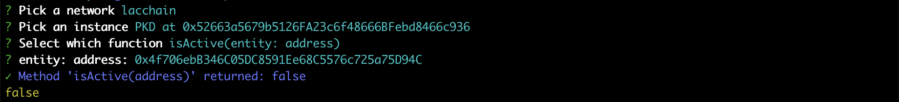

As we can see now the verification result is **false**, which
indicates that the entity has been revoked.