## Deploy Credential Registry

In order to use the Credential Registry as a decentralized credential
registration and verification method, it is necessary to clone the
repository that contains the smart contracts and install some additional
tools. Below are the steps to follow to have an environment to make the
correct deployment.

1. To clone the repository, execute the following
    command:

``` bash
$ git clone [https://github.com/lacchain/vc-contracts
```

The output of the command should download the contracts folder from the
repository, as shown in the following image:

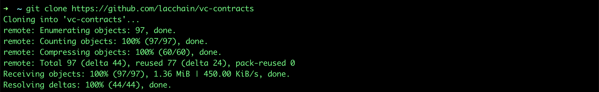

2. Once the repository is cloned, we proceed to deploy
    the smart contracts using the openzeppelin command line tool. To do
    this, the following command must be executed:

``` bash
$ npm i @openzeppelin/cli 
```

The above will install the openzeppelin CLI in the folder where the
command is run:

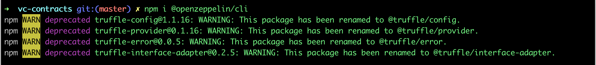

**Note**: If desired, it is
possible to install the tool globally by adding the -g flag to the
previous command, which will allow executing the openzeppelin command
line from any other project.

3. Once the OpenZeppelin CLI is installed, it is
    necessary to edit the network configuration to be used for the
    deployment. Inside the repository we rename the example
    configuration file called **truffle-config.default** to
    **truffle-config.js**

``` bash
$ mv truffle-config.default truffle-config.js
```

And we edit the **truffle-config.js** file to include the LACChain network
configuration. Consider the following code:


4. Once the truffle-config.js file has been saved, we
    proceed to initialize the OpenZeppelin project using the following
    command:

``` bash
$ npx oz init 
```

The command will request a name to the project: which is usually the
same name as the repository and the version: which is usually 1.0.0.

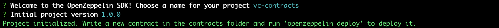

5. After initializing the OpenZeppelin project it is
    possible to deploy the CredentialRegistry contract with the
    following command:

``` bash
$ npx oz deploy 
```

The above command will invoke the openzeppelin CLI that has been
installed over the directory. If the tool was installed globally, the
npx prefix can be omitted. When deploying the contract, OpenZeppelin
will ask us to select the type of deployment: regular, the network:
lacchain, and the contract to deploy: **CredentialRegistry**, as shown
below:

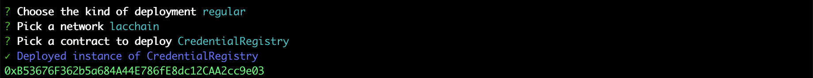

6. After deploying the **CredentialRegistry**, now we are
    going to deploy the Smart Contract **ClaimsVerifier**, which is the
    contract in charge of interacting with the applications. We run the
    following command again:

``` bash
$ npx oz deploy 
```

Selecting the same type of deployment and network, now we select the
ClaimsVerifier contract and put the address of the **CredentialRegistry**
generated in the previous step as shown in the following image:

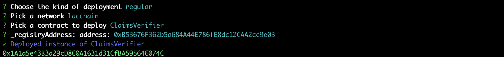

7. Because smart contracts make use of the
    OpenZeppelin Access Control System and the **ClaimsVerifier** works as a
    Facade of the **CredentialRegistry**, it is necessary to give the
   **ClaimsVerifier** permission to interact with the **CredentialRegistry** by
    assigning the address of the **ClaimsVerifier** with the role issuer
    within the **CredentialRegistry**. To assign the role to the contract,
    you can use the OZ CLI using the following command:

``` bash
$ npx oz send-tx 
```

To execute the command, the following parameters are used:

- **network**: lacchain
- **instance**: CredentialRegistry
- **function**: grantRole
- **role**: 0x114e74f6ea3bd819998f78687bfcb11b140da08e9b7d222fa9c1f1ba1f2aa122
- **account**: the ClaimsVerifier address

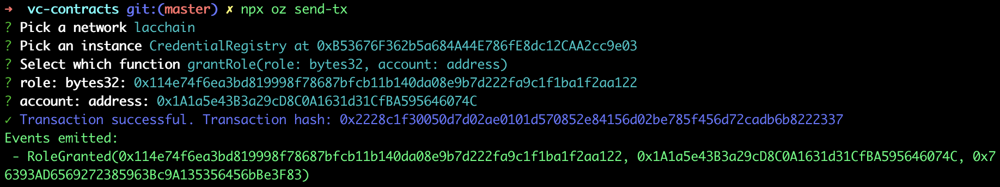

8. Similarly, you need to assign the issuer accounts
    to the **ClaimsVerifier** contract using the same command:

``` bash
$ npx oz send-tx 
```

- **network**: lacchain
- **instance**: ClaimsVerifier
- **function**: grantRole
- **role**: 0x114e74f6ea3bd819998f78687bfcb11b140da08e9b7d222fa9c1f1ba1f2aa122
- **account**: the issuer address

To execute the command, the following parameters are used:

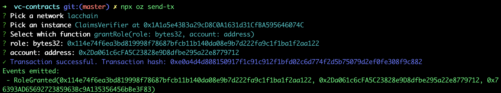

9. Optionally, **ClaimsVerifier** contract accounts can be
    assigned as signers using the same command:

``` bash
$ npx oz send-tx 
```

To execute the command, the following parameters are used:

- **network**: lacchain
- **instance**: ClaimsVerifier
- **function**: grantRole
- **role**: 0xe2f4eaae4a9751e85a3e4a7b9587827a877f29914755229b07a7b2da98285f70
- **account**: the issuer address

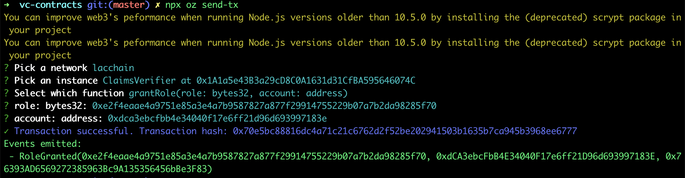

## Register Verifiable Credential

Once the Smart Contracts have been deployed and the roles configured, a
Verifiable Credential can now be registered, signed and verified. To register a
Verifiable Credential it is necessary to generate some digital signatures based on
EIP-712 using code in NodeJS, as shown below:

``` javascript
import ethers from "ethers";
import moment from "moment";
import { CLAIMS_VERIFIER_ABI, getCredentialHash, signCredential } from "@lacchain/vc-contracts-utils";

const CLAIMS_VERIFIER_ADDRESS = "0x1A1a5e43B3a29cD8C0A1631d31CfBA595646074C";
const ISSUER_ADDRESS = "0x2Da061c6cFA5C23828e9D8dfbe295a22e8779712";
const ISSUER_PRIVATE_KEY = "60090a13d72f682c03db585bf6c3a296600b5d50598a9ceef3291534dede6bea";

const vc = {
	"@context": "https://www.w3.org/2018/credentials/v1",
	id: "73bde252-cb3e-44ab-94f9-eba6a8a2f28d",
	type: "VerifiableCredential",
	issuer: `did:lac:main:${ISSUER_ADDRESS}`,
	issuanceDate: '2021-12-12T07:17:34.479Z',
	expirationDate: '2022-12-12T07:17:34.479Z',

	credentialSubject: {
		id: `did:lac:main:0xdca3ebcfbb4e34040f17e6ff21d96d693997183e`,
		data: 'anything'
	},
	proof: []
}

async function register() {
	const claimsVerifier = new ethers.Contract( CLAIMS_VERIFIER_ADDRESS, CLAIMS_VERIFIER_ABI,
		new ethers.Wallet( '0x' + ISSUER_PRIVATE_KEY, new ethers.providers.JsonRpcProvider( "https://writer.lacchain.net" ) ) );

	const credentialHash = getCredentialHash( vc, ISSUER_ADDRESS, CLAIMS_VERIFIER_ADDRESS );
	const signature = await signCredential( credentialHash, ISSUER_PRIVATE_KEY );

	await claimsVerifier.registerCredential( 'did:lac:main:0xdca3ebcfbb4e34040f17e6ff21d96d693997183e', credentialHash,
		Math.round( moment( vc.issuanceDate ).valueOf() / 1000 ),
		Math.round( moment( vc.expirationDate ).valueOf() / 1000 ),
		signature, { from: ISSUER_ADDRESS } );

vc.proof.push( {
	id: vc.issuer,
	type: "EcdsaSecp256k1Signature2019",
	proofPurpose: "assertionMethod",
	verificationMethod: `${vc.issuer}#vm-0`,
	domain: CLAIMS_VERIFIER_ADDRESS,
	proofValue: signature
} );

	console.log( vc );
}
register();
```

To execute the above code you have to execute the following commands:

``` bash
$ npm install ethers 
$ npm install moments 
$ npm install @lacchain/vc-contracts-utils 
$ node —-experimental-modules index.mjs
```

The result of the execution will give us the Verifiable Credential with
the signature of the issuer, as shown in the following image:

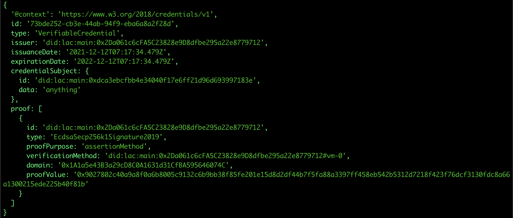

## Add additional signature to Verifiable Credential

After the credential has been registered it is necessary that it be
signed by all the Signers registered in **ClaimsVerifier** Smart Contract.
It is possible to register a signature of a Signer using the following
code:

``` javascript
import ethers from "ethers";
import { CLAIMS_VERIFIER_ABI, getCredentialHash, signCredential } from "@lacchain/vc-contracts-utils";

const CLAIMS_VERIFIER_ADDRESS = "0x1A1a5e43B3a29cD8C0A1631d31CfBA595646074C";
const ISSUER_ADDRESS = "0x2Da061c6cFA5C23828e9D8dfbe295a22e8779712";
const SIGNER_ADDRESS = "0xdca3ebcfbb4e34040f17e6ff21d96d693997183e";
const SIGNER_PRIVATE_KEY = "b4a2142e9b0a034ff0ab245ab80f336948079008200790787b917a4ce9ae0a98";

const vc = {
	"@context": "https://www.w3.org/2018/credentials/v1",
	id: "73bde252-cb3e-44ab-94f9-eba6a8a2f28d",
	type: "VerifiableCredential",
	issuer: `did:lac:main:${ISSUER_ADDRESS}`,
	issuanceDate: '2021-12-12T07:17:34.479Z',
	expirationDate: '2022-12-12T07:17:34.479Z',
	credentialSubject: {
		id: `did:lac:main:0xdca3ebcfbb4e34040f17e6ff21d96d693997183e`,
		data: 'anything'
	},
	proof: []
}

async function sign() {
	const claimsVerifier = new ethers.Contract( CLAIMS_VERIFIER_ADDRESS, CLAIMS_VERIFIER_ABI,
		new ethers.Wallet( '0x' + SIGNER_PRIVATE_KEY, new ethers.providers.JsonRpcProvider( "https://writer.lacchain.net" ) ) );

	const credentialHash = getCredentialHash( vc, ISSUER_ADDRESS, CLAIMS_VERIFIER_ADDRESS );
	const signature = await signCredential( credentialHash, SIGNER_PRIVATE_KEY );

	await claimsVerifier.registerSignature( credentialHash, ISSUER_ADDRESS, signature, { from: SIGNER_ADDRESS } );

	vc.proof.push( {
		id: `did:lac:main:${SIGNER_ADDRESS}`,
		type: "EcdsaSecp256k1Signature2019",
		proofPurpose: "assertionMethod",
		verificationMethod: `did:lac:main:${SIGNER_ADDRESS}#vm-0`,
		domain: CLAIMS_VERIFIER_ADDRESS,
		proofValue: signature
	} );

	console.log( vc );
}

sign();
```

The result of the execution will give us the Verifiable Credential with
the signature of the signer in the poof section, as shown in the
following image:

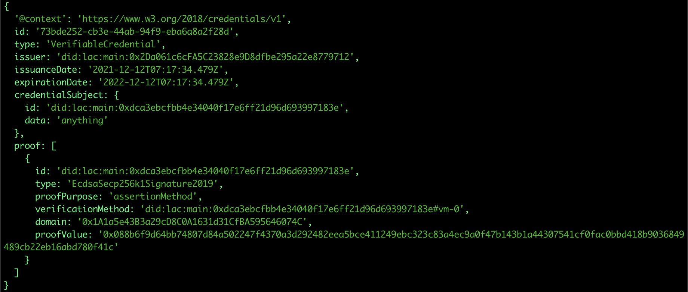

## Verify a Verifiable Credential

Once the Verifiable Credential is registered and signed, the proofs of the issuer
and the signers must be concatenated in the same proof array, as shown
below:

``` javascript
const vc = {
	'@context': 'https://www.w3.org/2018/credentials/v1',
	id: '73bde252-cb3e-44ab-94f9-eba6a8a2f28d',
	type: 'VerifiableCredential',
	issuer: 'did:lac:main:0x2Da061c6cFA5C23828e9D8dfbe295a22e8779712',
	issuanceDate: '2021-12-12T07:17:34.479Z',
	expirationDate: '2022-12-12T07:17:34.479Z',
	credentialSubject: {
		id: 'did:lac:main:0xdca3ebcfbb4e34040f17e6ff21d96d693997183e',
		data: 'anything'
	},
	proof: [
		{
			id: 'did:lac:main:0x2Da061c6cFA5C23828e9D8dfbe295a22e8779712',
			type: 'EcdsaSecp256k1Signature2019',
			proofPurpose: 'assertionMethod',
			verificationMethod: 'did:lac:main:0x2Da061c6cFA5C23828e9D8dfbe295a22e8779712#vm-0',
			domain: '0x1A1a5e43B3a29cD8C0A1631d31CfBA595646074C',
			proofValue: '0x9027802c40a9a8f0a6b8005c9132c6b9bb38f85fe201e15d8d2df44b7f5fa88a3397ff458eb542b5312d7218f423f76dcf3130fdc8a66a1300215ede225b40f81b'
		},
		{
			id: 'did:lac:main:0xdca3ebcfbb4e34040f17e6ff21d96d693997183e',
			type: 'EcdsaSecp256k1Signature2019',
			proofPurpose: 'assertionMethod',
			verificationMethod: 'did:lac:main:0xdca3ebcfbb4e34040f17e6ff21d96d693997183e#vm-0',
			domain: '0x1A1a5e43B3a29cD8C0A1631d31CfBA595646074C',
			proofValue: '0x088b6f9d64bb74807d84a502247f4370a3d292482eea5bce411249ebc323c83a4ec9a0f47b143b1a44307541cf0fac0bbd418b9036849489cb22eb16abd780f41c'
		}
	]
}
```

The function to verify a VC is shown in the following code:

``` javascript
import ethers from "ethers";
import moment from "moment";
import { CLAIMS_VERIFIER_ABI, getRSV, sha256 } from "@lacchain/vc-contracts-utils";

const CLAIMS_VERIFIER_ADDRESS = "0x1A1a5e43B3a29cD8C0A1631d31CfBA595646074C";

async function verify() {
	const claimsVerifier = new ethers.Contract( CLAIMS_VERIFIER_ADDRESS, CLAIMS_VERIFIER_ABI,
		new ethers.providers.JsonRpcProvider( "https://writer.lacchain.net" ) );

	const data = `0x${sha256( JSON.stringify( vc.credentialSubject ) )}`;
	const rsv = getRSV( vc.proof[0].proofValue );
	const result = await claimsVerifier.verifyCredential( [
		vc.issuer.replace( 'did:lac:main:', '' ),
		vc.credentialSubject.id.replace( 'did:lac:main:', '' ),
		data,
		Math.round( moment( vc.issuanceDate ).valueOf() / 1000 ),
		Math.round( moment( vc.expirationDate ).valueOf() / 1000 )
	], rsv.v, rsv.r, rsv.s );

	const credentialExists = result[0];
	const isNotRevoked = result[1];
	const issuerSignatureValid = result[2];
	const additionalSigners = result[3];
	const isNotExpired = result[4];

	console.log( { credentialExists, isNotRevoked, issuerSignatureValid, additionalSigners, isNotExpired } );
}

verify();
```

The output from executing the above code is as follows:

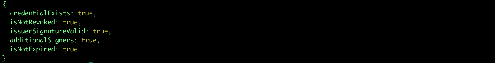

In the event that additional signers have been defined, the following
code must be executed to verify the signature of each one of them
individually:

``` javascript
import ethers from "ethers";
import moment from "moment";
import { CLAIMS_VERIFIER_ABI, sha256 } from "@lacchain/vc-contracts-utils";

const CLAIMS_VERIFIER_ADDRESS = "0x1A1a5e43B3a29cD8C0A1631d31CfBA595646074C";

async function verifySignature() {
	const claimsVerifier = new ethers.Contract( CLAIMS_VERIFIER_ADDRESS, CLAIMS_VERIFIER_ABI,
		new ethers.providers.JsonRpcProvider( "https://writer.lacchain.net" ) );

	const data = `0x${sha256( JSON.stringify( vc.credentialSubject ) )}`;

	const isValidSignature = await claimsVerifier.verifySigner( [
		vc.issuer.replace( 'did:lac:main:', '' ),
		vc.credentialSubject.id.replace( 'did:lac:main:', '' ),
		data,
		Math.round( moment( vc.issuanceDate ).valueOf() / 1000 ),
		Math.round( moment( vc.expirationDate ).valueOf() / 1000 )
	], vc.proof[1].proofValue );


	console.log( { isValidSignature } );
}

verifySignature();
```

If the signature is correct, the output of the above code is as follows:


The process must be run for each additional signature.

## Revoke a Verifiable Credential

Finally, as part of the process, it is possible to revoke a VC by
invoking the **revokeCredential** function of the Smart Contract using the
following code:

``` javascript
import ethers from "ethers";
import { CREDENTIAL_REGISTRY_ABI, getCredentialHash } from "@lacchain/vc-contracts-utils";

const CREDENTIAL_REGISTRY_ADDRESS = "0xB53676F362b5a684A44E786fE8dc12CAA2cc9e03";
const CLAIMS_VERIFIER_ADDRESS = "0x1A1a5e43B3a29cD8C0A1631d31CfBA595646074C";
const ISSUER_ADDRESS = "0x2Da061c6cFA5C23828e9D8dfbe295a22e8779712";
const ISSUER_PRIVATE_KEY = "60090a13d72f682c03db585bf6c3a296600b5d50598a9ceef3291534dede6bea";


async function revoke() {
	const credentialRegistry = new ethers.Contract( CREDENTIAL_REGISTRY_ADDRESS, CREDENTIAL_REGISTRY_ABI,
		new ethers.Wallet( '0x' + ISSUER_PRIVATE_KEY, new ethers.providers.JsonRpcProvider( "https://writer.lacchain.net" ) ) );

	const credentialHash = getCredentialHash( vc, ISSUER_ADDRESS, CLAIMS_VERIFIER_ADDRESS );

	const tx = await credentialRegistry.revokeCredential( credentialHash );

	console.log( { hash: tx.hash } );
}

revoke();
```

The result of the command execution only returns the hash of the
transaction.

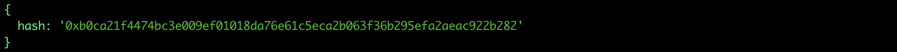

Once the credential is revoked, if we run the verification process
again, it will give us the following result:

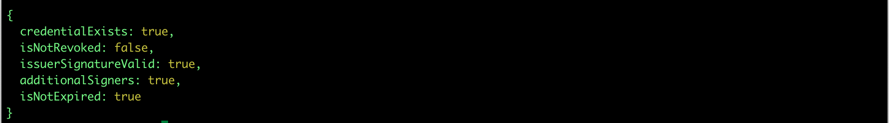

The result indicates that the credential exists, the signatures are
valid and it has not expired, but it is revoked (**isNotRevoked: false**)

